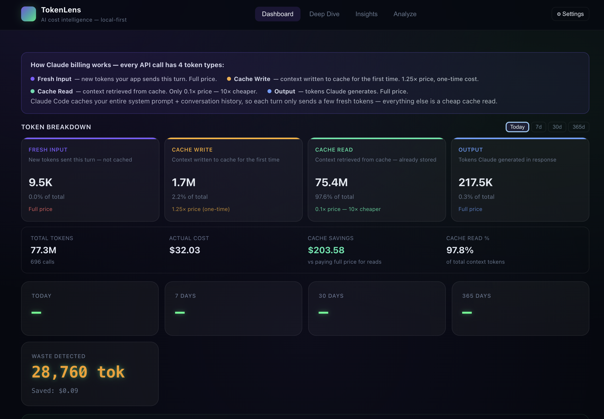
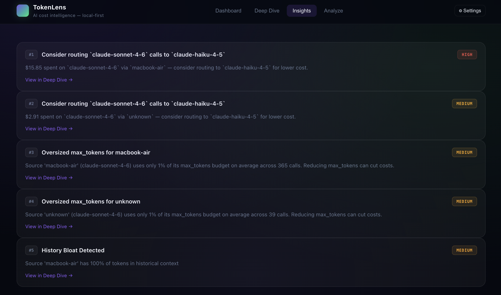
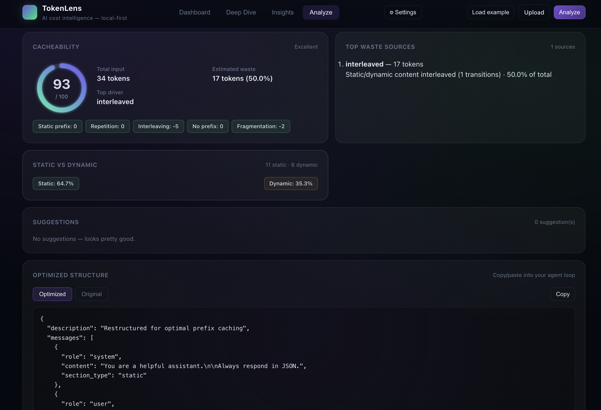

# TokenLens

**AI cost intelligence + gateway — local-first.**

TokenLens is a transparent proxy + dashboard that sits between your code and every AI provider. It records every API call, shows exactly where your money goes, detects waste, finds savings — and now acts as a full AI gateway: enforce quotas, route traffic, and block dangerous content before it reaches the model.

- **Zero config** — install, point your SDK, done
- **100% local** — your data never leaves your machine
- **Real-time** — live WebSocket feed of every API call
- **Works with** Anthropic, OpenAI, and Google AI
- **Gateway** — kill switches, quotas, model aliasing, fallback chains, PII/injection guardrails





---

## Quick Start

```bash
# 1. Install
pip install tokenlens        # or: pipx install tokenlens

# 2. Set up as background service (auto-starts on boot)
tokenlens install

# 3. Open dashboard
tokenlens ui
```

That's it. Your shell now has `ANTHROPIC_BASE_URL`, `OPENAI_BASE_URL`, and `GOOGLE_AI_BASE_URL` pointed at the TokenLens proxy. Every SDK call flows through TokenLens automatically.

### Manual setup (without daemon)

```bash
tokenlens daemon --port 8420

export ANTHROPIC_BASE_URL="http://localhost:8420/proxy/anthropic"
export OPENAI_BASE_URL="http://localhost:8420/proxy/openai"
export GOOGLE_AI_BASE_URL="http://localhost:8420/proxy/google"
```

---

## How It Works

```
Your App → SDK → TokenLens Proxy (localhost:8420) → AI Provider
                      ↓
              1. Budget check       — block if global daily/monthly limit exceeded
              2. Quota check        — block if source limit exceeded or kill switch active
              3. Routing            — resolve alias, weighted balance, latency select
              4. Request guardrails — scan prompt for PII / injection → warn or block
              5. Waste detection    — whitespace bloat, filler, redundant instructions
              6. Token heatmap      — section breakdown: system/tools/context/history/query
              7. Dedup check        — return cached response if TTL hit
              8. Upstream call      — retry fallback chain on 5xx / 429
              9. Response guardrails — scan model output for PII → warn or block
             10. Record + cost      — write to local SQLite
             11. Broadcast          — WebSocket → dashboard, CLI, alerts, webhooks
                      ↓
              Dashboard · tokenlens top · Alerts · Webhooks
```

TokenLens acts as a transparent HTTP proxy. It enforces policy, records cost, then forwards requests to the real AI provider — modifying only the model field when routing rules apply. Responses are returned to the caller untouched. All data stays in a local SQLite database.

---

## AI Gateway ✨ New

The gateway layer sits in the proxy pipeline and gives you control over what traffic reaches the model, how it's routed, and what content is allowed through.

### Kill Switches & Quotas

Block a runaway agent instantly, or set spend/call caps per source or model.

```bash
# Via API
curl -X PUT http://localhost:8420/api/config/quotas \
  -H 'Content-Type: application/json' \
  -d '{
    "kill_switches": ["my-agent"],
    "source_limits": [
      {"source": "my-agent", "daily_usd": 5.00, "monthly_usd": 50.00}
    ],
    "model_limits": [
      {"model": "claude-opus-4-6", "daily_calls": 100}
    ]
  }'
```

Or configure visually in **Settings → Per-Source Quotas**.

### Model Aliasing & Fallback Routing

Swap models transparently, and automatically retry on failures.

```bash
curl -X PUT http://localhost:8420/api/config/routing \
  -H 'Content-Type: application/json' \
  -d '{
    "aliases": [
      {"from": "gpt-4", "to": "claude-sonnet-4-6"}
    ],
    "fallback_chains": [
      {"trigger_model": "claude-opus-4-6",
       "fallbacks": ["claude-sonnet-4-6", "claude-haiku-4-5"]}
    ],
    "weights": [
      {"source": "my-agent", "rules": [
        {"model": "claude-haiku-4-5", "weight": 70},
        {"model": "claude-sonnet-4-6", "weight": 30}
      ]}
    ]
  }'
```

Or configure in **Settings → Model Routing**.

### Content Guardrails

Scan prompts and responses for PII and prompt injection. Choose warn (log only) or block (return 400).

```bash
curl -X PUT http://localhost:8420/api/config/guardrails \
  -H 'Content-Type: application/json' \
  -d '{
    "pii_detection": {"enabled": true, "action": "block"},
    "injection_detection": {"enabled": true, "action": "warn"},
    "custom_rules": [
      {"name": "no-ssn", "pattern": "\\d{3}-\\d{2}-\\d{4}", "action": "block"}
    ]
  }'
```

Or configure in **Settings → Content Guardrails**.

---

## Features

### Cost Intelligence

| Feature | Description |
|---------|-------------|
| **Real-time KPIs** | Total spend, savings, call count, and token breakdown at a glance |
| **Spend Forecasting** | Projected monthly cost with trend analysis and confidence scoring |
| **Token Cost Breakdown** | Daily cost split by input, output, cache read, and cache write tokens |
| **Cost Allocation Tags** | Per-source cost aggregation — see which tool or agent spends the most |
| **Model Comparison** | "What if I switched from Opus to Sonnet?" — instant cost comparison |
| **Budget Caps** | Global daily and monthly spend limits with automatic request blocking |
| **Custom Pricing** | Override default per-token rates for any model |
| **Cost Anomaly Detection** | Rolling mean + 2σ detection of spend, call count, and token spikes |
| **Cost Alerts** | Real-time WebSocket alerts when daily spend exceeds threshold |
| **Weekly Digest** | Automated Sunday report: spend, top sources, waste, budget projection |

### Token Intelligence

| Feature | Description |
|---------|-------------|
| **Token Waste Detection** | Identifies junk tokens: whitespace bloat, polite filler, redundant instructions, empty messages |
| **Output Utilization** | Tracks how much of your `max_tokens` budget is actually used per call |
| **Token Heatmap** | Breaks down every request into sections: system prompt, tools, context, history, query |
| **History Bloat Tracking** | Detects sources where conversation history consumes >60% of input tokens |
| **Model Right-Sizing** | Scores call complexity (0–9) and recommends cheaper models for simple tasks |

### AI Gateway ✨ New

| Feature | Description |
|---------|-------------|
| **Kill Switches** | Instantly block all traffic from a specific source (tool/agent) |
| **Per-Source Quotas** | Daily and monthly spend caps per source, with automatic request blocking |
| **Per-Model Call Limits** | Daily call count caps per model to prevent runaway usage |
| **Model Aliasing** | Transparently swap one model for another — callers use the alias, proxy uses the real model |
| **Fallback Chains** | On 5xx/429, retry with a priority-ordered list of fallback models |
| **Weighted Load Balancing** | Split traffic for a source across models by percentage weight |
| **Latency-Based Routing** | Route to the lowest-latency provider based on recent P99 measurements |
| **PII Detection** | Detect email, phone, SSN, and credit card numbers in prompts and responses |
| **Prompt Injection Detection** | Flag attempts to override system prompts or role-hijack the model |
| **Custom Guardrail Rules** | Add your own regex patterns with warn or block actions |
| **Request & Response Guardrails** | Guardrails apply to both the incoming prompt and the model's response |

### Developer Playground ✨ New

| Feature | Description |
|---------|-------------|
| **Model Selector** | Choose provider and model |
| **Temperature Control** | Slider (0–2) |
| **Cost Preview** | Estimated cost before running |
| **Live Execution** | Send prompts through the proxy — tracked in the dashboard |
| **Source Tagging** | All playground requests tagged as `playground` for cost attribution |

### Observability

| Feature | Description |
|---------|-------------|
| **Live Feed** | Real-time WebSocket stream of every API call with cost |
| **`tokenlens top`** | htop-style live terminal view: calls/min, cost/hr, cache %, waste |
| **Cache Hit Tracking** | Daily cache hit rate trend with improvement/degradation detection |
| **Provider Health** | P50/P95/P99 latency and error rates per provider |
| **Rate Limit Tracking** | Hourly 429 error counts and timeline per provider |
| **Request Logging** | Optional full request/response body capture for debugging |
| **Session Detection** | Groups API calls into logical sessions by timing and source |
| **Prometheus Metrics** | `GET /metrics` endpoint for Grafana/Prometheus integration |
| **Request Deduplication** | Cache identical requests within a TTL window (opt-in) |

### Recommendations

| Feature | Description |
|---------|-------------|
| **12-Check Engine** | Automated analysis: cache utilization, model costs, prompt sizes, waste, history bloat, model right-sizing, and more |
| **Actionable Insights** | Each recommendation includes estimated savings impact |

### Integrations

| Feature | Description |
|---------|-------------|
| **CSV Export** | Download usage data for spreadsheets or BI tools |
| **Webhook Notifications** | HTTP callbacks on `call_recorded`, `cost_alert`, and `weekly_digest` events |
| **Prometheus /metrics** | Standard exposition format for monitoring stacks |
| **`tokenlens report`** | CLI command to print or export the weekly cost digest |

---

## CLI Reference

```
tokenlens install             # Install as background service (auto-starts on boot)
tokenlens uninstall [--purge] # Remove service (--purge deletes all data)
tokenlens ui [--port 8420]    # Open dashboard in browser
tokenlens daemon              # Run server in foreground (for debugging)
tokenlens status              # Show daemon status
tokenlens top [--port 8420]   # Live htop-style terminal view of API traffic
tokenlens report [--days 7]   # Print weekly cost digest
tokenlens analyze <file|->    # Analyze a prompt trace for waste
```

### `tokenlens top` keys

```
q / Q    Quit
p / P    Pause / resume live feed
```

### `tokenlens report` options

```
--days N          Days to include (default: 7)
--format human    Human-readable text (default)
--format json     JSON output for scripting
--port N          Daemon port (default: 8420)
```

### `tokenlens analyze` options

```
--format human|json     Output format (default: human)
--suggestions           Show full suggestion details
--score-only            Print only the cacheability score
--min-tokens N          Minimum tokens to flag (default: 50)
```

---

## API Reference

All endpoints are served at `http://localhost:8420` (default port).

### Usage

| Method | Endpoint | Description |
|--------|----------|-------------|
| `GET` | `/api/usage/kpi?days=30` | KPI summary (cost, savings, tokens) |
| `GET` | `/api/usage/daily?days=30` | Daily aggregated usage |
| `GET` | `/api/usage/recent?limit=50` | Recent raw API calls |
| `GET` | `/api/usage/sources` | Cost breakdown by source |
| `GET` | `/api/usage/forecast` | Projected monthly spend |
| `GET` | `/api/usage/by-tag?days=30` | Cost allocation by tag/source |
| `GET` | `/api/usage/token-breakdown?days=30` | Cost split by token type |
| `GET` | `/api/usage/cache-trend?days=30` | Cache hit rate over time |
| `GET` | `/api/usage/compare?from_model=X&to_model=Y` | Model cost comparison |
| `GET` | `/api/usage/sessions?days=1` | Detected sessions |
| `GET` | `/api/usage/budget-status` | Current spend vs limits |
| `GET` | `/api/usage/provider-health?days=1` | Latency and error rates |
| `GET` | `/api/usage/rate-limits?days=1` | Rate limit (429) events |
| `GET` | `/api/usage/recommendations` | Cost recommendations |
| `GET` | `/api/usage/waste-summary?days=30` | Token waste breakdown by type |
| `GET` | `/api/usage/conversation-efficiency?days=30` | History bloat per source |
| `GET` | `/api/usage/token-heatmap?days=30` | Token section breakdown per call |
| `GET` | `/api/usage/anomalies?days=30` | Spend/call/token anomalies |
| `GET` | `/api/usage/right-sizing?days=30` | Model right-sizing recommendations |
| `GET` | `/api/usage/digest?days=7` | Weekly cost digest |

### Settings

| Method | Endpoint | Description |
|--------|----------|-------------|
| `GET/PUT` | `/api/settings/alerts` | Cost alert thresholds |
| `GET/PUT` | `/api/settings/budget` | Budget cap configuration |
| `GET/PUT` | `/api/settings/pricing` | Custom pricing overrides |
| `GET/PUT` | `/api/settings/webhooks` | Webhook notification config |

### Gateway

| Method | Endpoint | Description |
|--------|----------|-------------|
| `GET/PUT` | `/api/config/quotas` | Per-source quotas, per-model call limits, kill switches |
| `GET/PUT` | `/api/config/routing` | Model aliases, fallback chains, weighted balancing, latency routing |
| `GET/PUT` | `/api/config/guardrails` | PII detection, injection detection, custom regex rules |
| `POST` | `/api/playground/run` | Execute a prompt through the proxy from the Developer Playground |

### Other

| Method | Endpoint | Description |
|--------|----------|-------------|
| `GET` | `/api/status` | Daemon health and DB stats |
| `GET` | `/api/export/csv?days=30` | Download usage as CSV |
| `GET` | `/api/logs?limit=20` | Request/response logs |
| `GET` | `/api/logs/{id}` | Single log entry detail |
| `GET` | `/metrics` | Prometheus metrics |
| `POST` | `/api/analyze` | Analyze prompt for cacheability |
| `WS` | `/api/live` | Real-time call stream |
| `ANY` | `/proxy/{provider}/{path}` | Transparent API proxy |

---

## Configuration

TokenLens stores its data in `~/.tokenlens/`:

```
~/.tokenlens/
  usage.db        # SQLite database (all usage data)
  config.toml     # Retention settings
  logs/           # Daemon logs
```

### Settings (via API or Dashboard → Settings tab)

| Setting | Default | Description |
|---------|---------|-------------|
| `budget.daily_limit_usd` | — | Global daily spend cap |
| `budget.monthly_limit_usd` | — | Global monthly spend cap |
| `budget.enabled` | `false` | Enable budget enforcement |
| `alerts.daily_cost_threshold` | — | Alert when daily spend exceeds this |
| `alerts.enabled` | `false` | Enable cost alerts |
| `webhook.url` | — | Webhook endpoint URL |
| `webhook.events` | — | Comma-separated: `call_recorded`, `cost_alert`, `weekly_digest` |
| `webhook.enabled` | `false` | Enable webhooks |
| `logging.enabled` | `false` | Capture request/response bodies |
| `dedup.enabled` | `false` | Enable request deduplication |
| `dedup.ttl_seconds` | `60` | Dedup cache TTL |
| `quotas.config` | — | Per-source quotas, per-model limits, kill switches (JSON — see Gateway section) |
| `routing.config` | — | Model aliases, fallback chains, weights, latency routing (JSON — see Gateway section) |
| `guardrails.config` | — | PII detection, injection detection, custom rules (JSON — see Gateway section) |

---

## Development

```bash
git clone https://github.com/stephenlthorn/token-lens.git
cd token-lens
python3 -m venv .venv && source .venv/bin/activate
pip install -e ".[dev]"
python3 -m pytest tests/ -v
```

### Requirements

- Python 3.11+
- No external services required

---

## Sponsorship

If TokenLens helps you ship faster or cut token spend, consider sponsoring:

https://github.com/sponsors/stephenlthorn

| Tier | Price |
|------|-------|
| Supporter | $5/month |
| Power User | $25/month |
| Company Sponsor | $200/month |

---

## License

See [LICENSE](./LICENSE) for details.
